<h1 align="center">🚀 Week 7: Truncate and Load ADF Pipeline 🚀</h1>

<p align="center">
  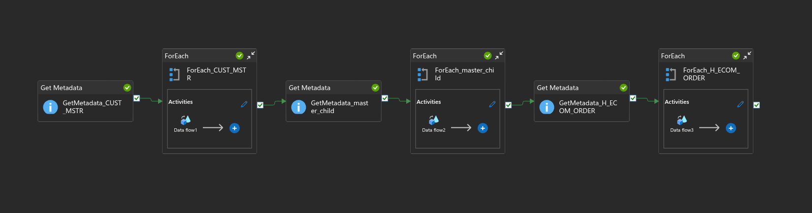
</p>

## 📌 Project Overview

This week's task was to build a **Truncate and Load ADF pipeline** that runs **daily** and handles data from three different types of CSV files stored in Azure Data Lake Storage (ADLS Gen2). We explored advanced features in **Azure Data Factory (ADF)** like:

* Metadata activity
* Parameterized Data Flows
* Conditional transformations
* Daily scheduled triggers
* Auto date parsing from filenames


## 🧠 Problem Statement

You're given 3 types of files stored in respective folders:

1. `CUST_MSTR_20191112.csv`
2. `master_child_export-20191112.csv`
3. `H_ECOM_ORDER.csv`

Each file needs to be processed as follows:

| File Type               | Task                                                                                     |
| ----------------------- | ---------------------------------------------------------------------------------------- |
| `CUST_MSTR_*.csv`       | Extract `file_date` from filename → `2019-11-12` → Load into `CUST_MSTR` table           |
| `master_child_export-*` | Extract `file_date` and `date_key` → `2019-11-12`, `20191112` → Load into `master_child` |
| `H_ECOM_ORDER.csv`      | Directly load into the `H_ECOM_Orders` table                                             |

📝 **Note**: Each load should truncate existing table data and run on a daily schedule.

> 🙏 Acknowledge to CSI (Celebal Technologies) for this learning opportunity during internship!


## 🏗️ Azure Resources Used

* Azure Data Factory (ADF)
* Azure SQL Database + Server
* Azure Data Lake Storage Gen2

<p align="center">
  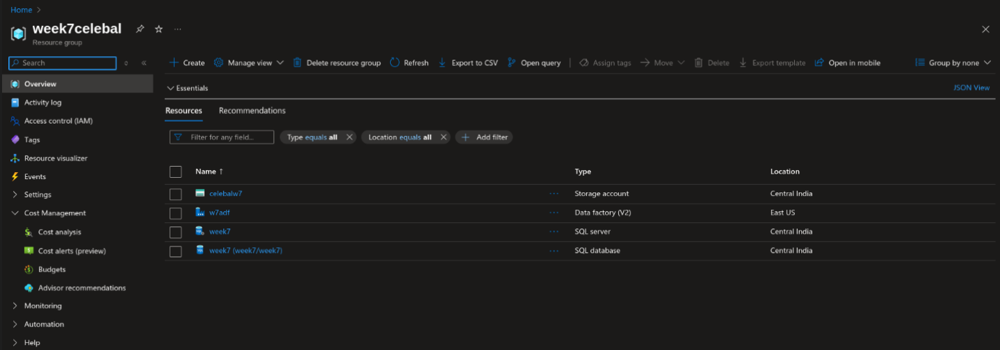
</p>


## 🔗 Linked Services

Set up connections for:

* Azure SQL DB
* Azure Data Lake Gen2

<p align="center">
  
</p>


## 🗂️ Datasets

You’ll need to define datasets for:

* CSV files (for all three folders)
* Tables (SQL sink datasets)

<p align="center">
  
</p>


## 🧪 Pipeline Architecture

<p align="center">
  
</p>

This is the master pipeline that processes and loads all 3 types of files into their respective SQL tables on a daily basis.


## 🔁 CUST\_MSTR Flow

### ✅ Metadata Activity

<p align="center">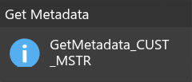</p>

📌 Dataset: `CUST_MSTR_CSV`

### ✅ ForEach + Data Flow

<p align="center">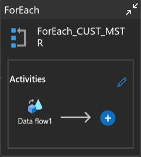</p>

📌 Items:

```json
@activity('GetMetadata_CUST_MSTR').output.childItems
```

### ✅ Data Flow Logic

<p align="center">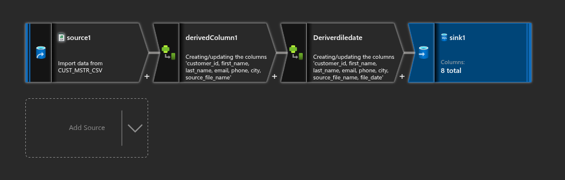</p>

* **Derived Column**: `file_date`

```plaintext
toDate(
  replace(
    split(split(byName('source_file_name'), '/')[3], '_')[3],
    '.csv',
    ''
  ),
  'yyyyMMdd'
)
```

<p align="center">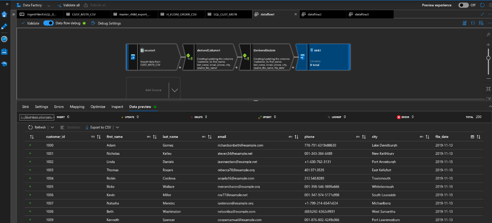</p>


## 🔁 master\_child\_export Flow

### ✅ Metadata Activity

<p align="center">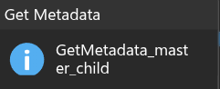</p>

📌 Dataset: `master_child.csv`

### ✅ ForEach + Data Flow

<p align="center">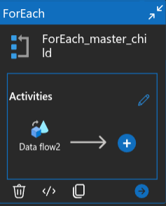</p>

📌 Items:

```json
@activity('GetMetadata_master_child').output.childItems
```

### ✅ Data Flow Logic

<p align="center">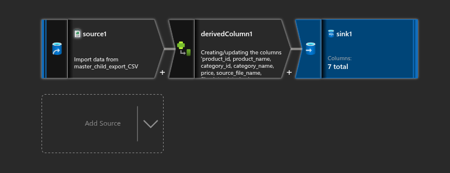</p>

* **Derived Column**:

```plaintext
file_date: toDate(replace(split(split(byName('source_file_name'), '/')[3],'-')[2],'.csv',''),'yyyyMMdd')

date_key: replace(split(split(byName('source_file_name'), '/')[3],'-')[2],'.csv','')
```

<p align="center">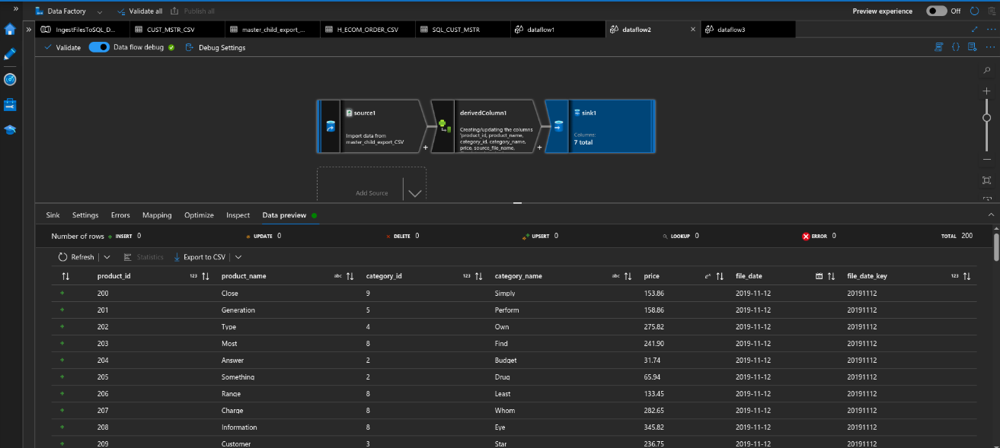</p>


## 🔁 H\_ECOM\_ORDER Flow

### ✅ Metadata Activity

<p align="center">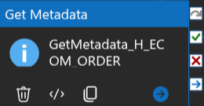</p>

📌 Dataset: `H_ECOM_ORDER.csv`

### ✅ ForEach + Data Flow

<p align="center"></p>

📌 Items:

```json
@activity('GetMetadata_H_ECOM_ORDER').output.childItems
```

### ✅ Data Flow Logic

<p align="center">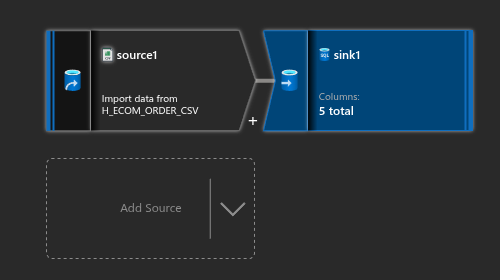</p>

* No transformation — load as-is

<p align="center">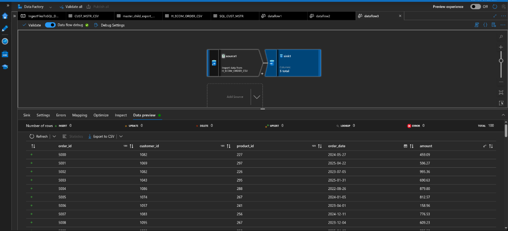</p>


## ⏰ Trigger Configuration

This pipeline is triggered **daily** using a scheduled trigger.

<p align="center">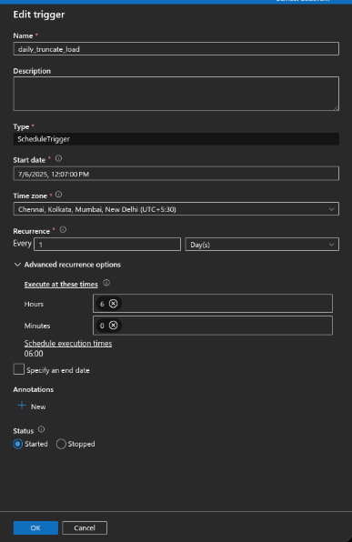</p>
<p align="center">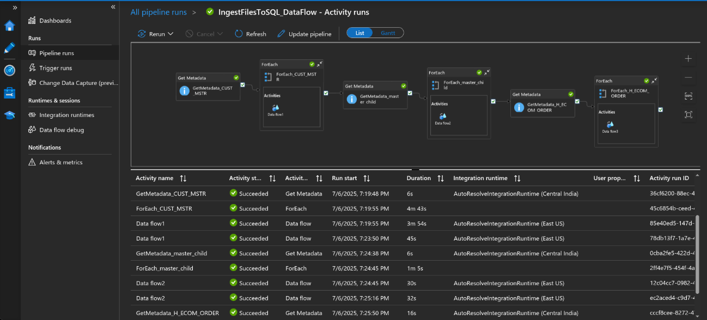</p>


## ✨ Cherry on Top

You can further improve this pipeline by:

* Adding email notification on success/failure using Logic Apps or ADF Webhook + Azure Function.
* Logging execution stats to a separate audit table (e.g., record count, filenames).
* Making the pipeline fully dynamic using parameters, file filters, and custom triggers.


### 💸 Cost

This entire ADF pipeline runs smoothly at a cost of only **₹30 / 2 days** if you're not on a free tier.

---

If you liked this breakdown or found it helpful, feel free to ⭐ the repo!

